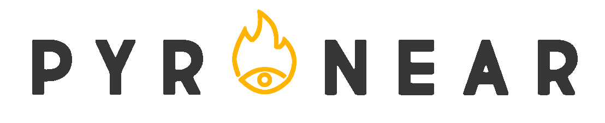

<p align="center">
  <a href="https://github.com/pyronear/pyro-vision/actions?query=workflow%3Abuilds">
    
  </a>
  <a href="https://pyronear.org/pyro-vision/">
    
  </a>
  <a href="https://codecov.io/gh/pyronear/pyro-vision">
    
  </a>
  <a href="https://github.com/ambv/black">
    
  </a>
  <a href="https://www.codacy.com/gh/pyronear/pyro-vision/dashboard?utm_source=github.com&amp;utm_medium=referral&amp;utm_content=pyronear/pyro-vision&amp;utm_campaign=Badge_Grade"></a>
</p>
<p align="center">
  <a href="https://pypi.org/project/pyrovision/">
    
  </a>
  <a href="https://anaconda.org/pyronear/pyrovision">
    
  </a>
  <a href="https://hub.docker.com/r/pyronear/pyro-vision">
    
  </a>
  
  
</p>


# Pyrovision: wildfire early detection

The increasing adoption of mobile phones have significantly shortened the time required for firefighting agents to be alerted of a starting wildfire. In less dense areas, limiting and minimizing this duration remains critical to preserve forest areas.

Pyrovision aims at providing the means to create a wildfire early detection system with state-of-the-art performances at minimal deployment costs.


## Quick Tour

### Automatic wildfire detection in PyTorch

You can use the library like any other python package to detect wildfires as follows:

```python
from pyrovision.models import rexnet1_0x
from torchvision import transforms
import torch
from PIL import Image


# Init
normalize = transforms.Normalize(mean=[0.485, 0.456, 0.406], std=[0.229, 0.224, 0.225])

tf = transforms.Compose([transforms.Resize(size=(448)), transforms.CenterCrop(size=448),
                         transforms.ToTensor(), normalize])

model = rexnet1_0x(pretrained=True).eval()

# Predict
im = tf(Image.open("path/to/your/image.jpg").convert('RGB'))

with torch.no_grad():
    pred = model(im.unsqueeze(0))
    is_wildfire = torch.sigmoid(pred).item() >= 0.5
```


## Setup

Python 3.6 (or higher) and [pip](https://pip.pypa.io/en/stable/)/[conda](https://docs.conda.io/en/latest/miniconda.html) are required to install PyroVision.

### Stable release

You can install the last stable release of the package using [pypi](https://pypi.org/project/pyrovision/) as follows:

```shell
pip install pyrovision
```

or using [conda](https://anaconda.org/pyronear/pyrovision):

```shell
conda install -c pyronear pyrovision
```

### Developer installation

Alternatively, if you wish to use the latest features of the project that haven't made their way to a release yet, you can install the package from source:

```shell
git clone https://github.com/pyronear/pyro-vision.git
pip install -e pyro-vision/.
```


## What else

### Documentation

The full package documentation is available [here](https://pyronear.org/pyro-vision/) for detailed specifications.

### Demo app

The project includes a minimal demo app using [Gradio](https://gradio.app/)


You can check the live demo, hosted on :hugs: [HuggingFace Spaces](https://huggingface.co/spaces) :hugs: over here :point_down:
[](https://huggingface.co/spaces/pyronear/vision)


### Docker container

If you wish to deploy containerized environments, a Dockerfile is provided for you build a docker image:

```shell
docker build . -t <YOUR_IMAGE_TAG>
```

### Minimal API template

Looking for a boilerplate to deploy a model from PyroVision with a REST API? Thanks to the wonderful [FastAPI](https://github.com/tiangolo/fastapi) framework, you can do this easily. Follow the instructions in [`./api`](api) to get your own API running!


### Reference scripts

If you wish to train models on your own, we provide training scripts for multiple tasks!
Please refer to the [`./references`](references) folder if that's the case.


## Citation

If you wish to cite this project, feel free to use this [BibTeX](http://www.bibtex.org/) reference:

```bibtex
@misc{pyrovision2019,
    title={Pyrovision: wildfire early detection},
    author={Pyronear contributors},
    year={2019},
    month={October},
    publisher = {GitHub},
    howpublished = {\url{https://github.com/pyronear/pyro-vision}}
}
```


## Contributing

Please refer to [`CONTRIBUTING`](CONTRIBUTING.md) to help grow this project!


## License

Distributed under the Apache 2 License. See [`LICENSE`](LICENSE) for more information.
